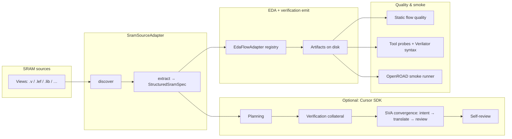
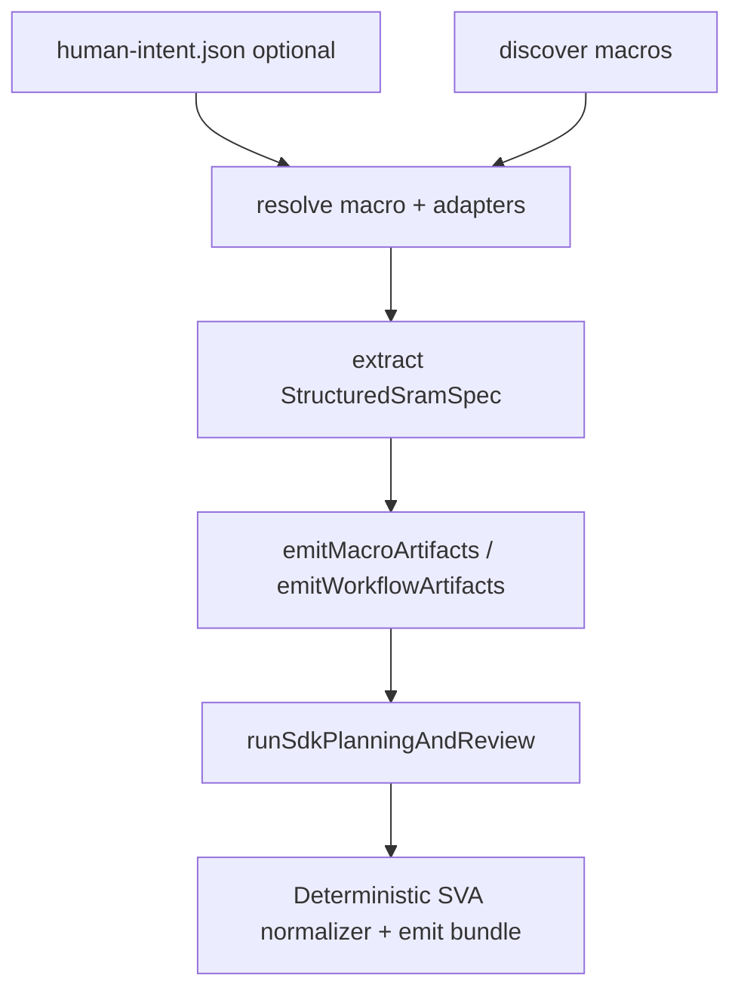

# Cursor SDK SRAM workflow prototype

Deterministic **SRAM22** view parsing and **EDA flow emission** (Hammer, OpenLane, OpenROAD, verification), plus optional **Cursor SDK** planning, verification collateral, **SVA convergence loop**, and **human-in-the-loop** requirements. All numeric facts in the structured spec trace to files under the repository `data/` tree.

Run commands from the **repository root** (`SRAM_SPEC_TO_WORKFLPW/`); npm scripts invoke this package’s CLI.

---

## Architecture (high level)



**Human-in-the-loop** sits *before* extraction on `agent-run`: optional YAML/JSON requirements resolve to `human-intent.json`, drive macro selection (when not explicit), EDA adapter subset, convergence iteration cap, and are injected into all SDK prompts (labeled as non-source evidence).



---

## Agentic phases (Cursor SDK)

When `CURSOR_API_KEY` is set and you run `agent:run`, the orchestrator (`src/sdk/agentRunner.ts`) runs phases in order, streaming JSONL events to `outputs/<run-id>/agent-events.jsonl`:

| Step | Phase | Role (prompt intent) |
|------|-------|----------------------|
| A | `planning` | Workflow plan from structured spec |
| B | `verification-collateral` | Rich SVA / checker ideas (source-backed) |
| C | **Convergence loop** (0–N iterations, see below) | Intent → proposals → reviewer decision |
| D | `review` | Full self-review of emitted artifacts |

**Inside each convergence iteration** (when enabled; iteration cap from human intent or default):

| Sub-phase | Log label | Role |
|-----------|-----------|------|
| 1 | `spec-intention-extraction` | Structured verification intent JSON |
| 2 | `sva-translation` | Property proposals JSON (not final SVA prose) |
| 3 | `spec-review` | Accept / revise / blocked JSON |

**SVA convergence:** After the SDK returns, the CLI still builds the **deterministic** bundle (`buildVerificationIntent` → `buildDefaultPropertyProposals` → `normalizePropertyCatalog` → `emitVerificationCollateralBundle` in `src/verification-collateral/` and `cli.ts`) so final split SVA and `properties.json` are reproducible. Per-iteration agent payloads are recorded under `outputs/<run-id>/convergence/iteration-*`; `convergence/final/` holds the normalized bundle.

---

## Key features

| Area | What it does |
|------|----------------|
| **Structured spec** | `StructuredSramSpec` with `TracedValue<T>`, validation issues, `interfaceProtocol` for SVA-ready protocol facts (`src/spec/`, `src/extract/`). |
| **Source adapter** | `SramSourceAdapter` for SRAM22: discover + extract (`src/sram-sources/sram22/`, `src/extract/`). |
| **EDA adapters** | Hammer, OpenLane, OpenROAD, verification emitters; registry + `selectEdaFlowAdapters` (`src/eda-adapters/`). |
| **Subset emit** | `edaAdapters` option + `emittedAdapterIds`; static quality skips families not emitted (`src/emit/workflow.ts`, `src/review/flowArtifactQuality.ts`). |
| **Quality & smoke** | Flow artifact analysis, Verilator syntax plans, OpenROAD log classification, bounded smoke exec (`src/review/`, `src/smoke/`). |
| **HITL** | `--requirements`, `--interactive`; `human-intent/*` modules; artifacts at run root (`src/human-intent/`, `src/cli.ts`). |
| **Verification collateral** | Split SVA: assumptions, assertions, covers, scoreboard, bind + `properties.json` (`src/verification-collateral/`, `src/eda-adapters/verification/`). |

---

## Code structure

```
prototypes/cursor-sdk-sram-workflow/
├── src/
│   ├── cli.ts                 # Commander: discover, extract, agent-run, flow-quality, smoke-run
│   ├── core/                  # artifacts, quality, smoke contracts
│   ├── domains/sram/        # SramSourceAdapter + canonical type aliases
│   ├── adapters/eda/        # EdaFlowAdapter interface (shared)
│   ├── sram-sources/        # sram22 adapter + name parsing
│   ├── extract/             # discover, sram22 extract, batch, readiness, view parsers, interfaceProtocol
│   ├── spec/                # types, provenance, validateSpec, schema
│   ├── emit/                # workflow (orchestrates adapters), edaTargets registry, run/iteration reports
│   ├── eda-adapters/        # hammer, openlane, openroad, verification + runtime (tool probes, log classify)
│   ├── human-intent/        # schema, load, resolve, write (HITL)
│   ├── verification-collateral/  # property schema, normalize, emit (SVA convergence output)
│   ├── sdk/                 # agentRunner (Cursor SDK), prompts
│   ├── tui/                 # interactive terminal chat session + event renderer
│   ├── review/              # traceability checks, flowArtifactQuality, flowSmoke
│   └── smoke/               # OpenROAD smoke execution + reports
├── examples/
│   └── flow-requirements.sram22-64x32.yaml   # sample HITL requirements
└── test/                    # Vitest unit + integration tests
```

---

## CLI usage

All scripts are defined in the **repo root** `package.json` and point at `prototypes/cursor-sdk-sram-workflow/src/cli.ts`.

| Command | API key | Purpose |
|---------|---------|---------|
| `npm run discover` | No | List discovered SRAM22 macros and view paths |
| `npm run demo:extract -- [<macro>] [--run-id <id>] [--summary] [--all]` | No | Deterministic extract + full emit + reports |
| `npm run flow:quality -- <run-id> [--write]` | No | Re-analyze `outputs/<run-id>` static quality; `--write` refreshes iteration markdown |
| `npm run smoke-run -- <run-id>` | No | Bounded OpenROAD smoke attempt + exec report |
| `npm run agent:run -- [macro] [--run-id <id>] [--requirements <path>] [--interactive]` | **Yes** | Extract + emit + Cursor SDK (planning, collateral, **SVA convergence**, review) + convergence artifacts |
| `npm run chat -- [macro] [--run-id <id>] [--requirements <path>] [--interactive]` | **Yes** | Interactive TUI chat loop with streamed tool calls and clarification handling |

**HITL examples**

```bash
# Default macro from CLI arg; intent file optional
export CURSOR_API_KEY=…
npm run agent:run -- sram22_64x32m4w8 --run-id my-run

# Requirements-driven macro + EDA targets + verification policy
npm run agent:run -- --requirements prototypes/cursor-sdk-sram-workflow/examples/flow-requirements.sram22-64x32.yaml --run-id my-run

# Ambiguous macro selection: add --interactive to pick from the terminal
npm run agent:run -- --requirements ./my-intent.yaml --interactive --run-id my-run

# Interactive TUI session with SDK streaming + clarification prompts
npm run chat -- --requirements ./my-intent.yaml --interactive --run-id my-chat
```

### Clarification protocol in TUI chat

When the agent needs a required/optional decision, it emits:

```text
CLARIFICATION_REQUEST:
question: <single concise question>
choices: <choice1>|<choice2>|...
required: true|false
```

The TUI pauses, prompts the user, and sends the answer back into the same agent conversation.

**Typical outputs** (`outputs/<run-id>/`)

- `human-intent.json`, `human-intent-source.json` — when using `agent-run` (defaults or requirements)
- `<macro>/` — `spec.json`, `spec.yaml`, Hammer/OpenLane/OpenROAD/verification files, `flow-smoke-report.json`
- `run-report.json`, `iteration-report.md`
- **Agent run only:** `agent-events.jsonl`, `agent-verification-collateral.md`, `agent-convergence-report.md`, `convergence/`

---

## Development

```bash
npm test
npm run typecheck
```

---

## Related documentation

- Repository overview and data pointers: `CLAUDE.md` (repo root)
- Broader prototype notes: `docs/workflow-prototype.md`
